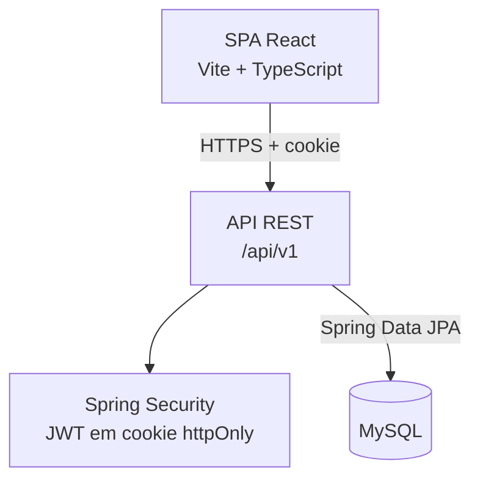

<p align="center">
  
</p>

<h1 align="center">Zenix App</h1>

<p align="center">
  Sistema de gestão para barbearias — fila de atendimento, controle financeiro e planos de assinatura em um só lugar.
</p>

<p align="center">
  
  
  
  
  
  
</p>

## Sobre o projeto

Muitas barbearias ainda dependem do registro manual dos atendimentos, o que dificulta o controle financeiro e operacional e acaba prejudicando a produtividade do barbeiro. O **Zenix App** nasceu para resolver esse problema: uma plataforma que digitaliza o dia a dia da barbearia, do check-in do cliente na fila até o fechamento financeiro do mês.

Barbeiros registram os atendimentos realizados e sabem exatamente quanto estão faturando. Donos acompanham indicadores consolidados — faturamento, comissões, serviços mais prestados — e organizam a fila de espera e os planos de assinatura dos clientes, tudo em uma única unidade ou em múltiplas filiais.

## Funcionalidades principais

- **Fila de atendimento (check-in sem login)** — o cliente entra na fila de uma unidade informando telefone e serviço desejado, sem precisar de conta ou senha.
- **Registro de atendimentos** — cada barbeiro registra os serviços realizados, com valor, forma de pagamento e observações.
- **Clientes e histórico de retorno** — cadastro de clientes vinculado a telefone, com contagem de quantas vezes cada cliente retornou.
- **Planos de assinatura mensal** — clientes podem assinar planos com limite de atendimentos por mês e renovação automática na data de vencimento.
- **Múltiplas unidades/filiais** — cada unidade tem seus próprios usuários, fila e atendimentos.
- **Dashboard financeiro** — relatórios de faturamento, comissão por barbeiro e serviços mais prestados, com filtro por período.
- **Autenticação e papéis de acesso** — login via JWT (cookie httpOnly), com dois papéis: `ADMIN` (gestão completa) e `USER` (barbeiro, operação do dia a dia).

## Arquitetura

O projeto é dividido em dois módulos independentes — uma API REST em Java/Spring Boot e uma SPA em React — que se comunicam via HTTP, com autenticação baseada em cookie.

O fluxo, em resumo:

1. A **SPA React** faz as requisições para a API por HTTPS, enviando o cookie `auth_token`.
2. A **API REST** valida o token no **Spring Security** antes de liberar o recurso.
3. Os dados são persistidos no **MySQL** via **Spring Data JPA**.



<details>
<summary>Ver o diagrama em texto (para leitores que não renderizam Mermaid)</summary>

```text
  Navegador
  +---------------------------+
  |  SPA React                |
  |  Vite + TypeScript        |
  +---------------------------+
               |
               |  HTTPS + cookie auth_token
               v
  Backend (Spring Boot)
  +---------------------------+
  |  API REST  /api/v1        |
  |  Spring Security + JWT    |
  +---------------------------+
               |
               |  Spring Data JPA
               v
  +---------------------------+
  |  MySQL                    |
  +---------------------------+
```

</details>

## Stack tecnológica

### Backend

| Tecnologia | Uso |
|---|---|
| Java 21 | Linguagem principal |
| Spring Boot 4 | Framework da API REST |
| Spring Data JPA | Persistência e acesso ao banco de dados |
| Spring Security | Autenticação e autorização |
| JWT (Auth0 `java-jwt`) | Geração e validação de tokens, transportados em cookie httpOnly |
| MySQL | Banco de dados relacional |
| MapStruct / ModelMapper | Mapeamento entre entidades e DTOs |
| springdoc-openapi | Documentação interativa da API (Swagger UI) |
| Maven | Build e gerenciamento de dependências |

### Frontend

| Tecnologia | Uso |
|---|---|
| React 19 | Biblioteca de UI |
| TypeScript | Tipagem estática |
| Vite | Build tool e dev server |
| React Router | Roteamento da SPA |
| Tailwind CSS | Estilização utilitária |
| shadcn/ui + Radix | Biblioteca de componentes |
| Axios | Cliente HTTP |
| Recharts | Gráficos do dashboard |

## Estrutura do repositório

```
zenix-app/
├── backend/     # API REST em Java + Spring Boot (regras de negócio, autenticação, persistência)
└── frontend/    # SPA em React + TypeScript (interface para donos, barbeiros e clientes)
```

## Como executar localmente

### Pré-requisitos

- Java 21
- Maven (ou o wrapper `./mvnw` já incluso no projeto)
- Node.js 20+ e npm
- MySQL 8 acessível (local ou remoto)

### Variáveis de ambiente (backend)

O backend espera as seguintes variáveis de ambiente (não há `.env` versionado no repositório):

| Variável | Descrição |
|---|---|
| `DB_URL` | URL de conexão JDBC com o MySQL |
| `DB_USER` | Usuário do banco de dados |
| `DB_PASSWORD` | Senha do banco de dados |
| `SECURITY_KEY` | Segredo usado para assinar os tokens JWT |

### Subindo o backend

```bash
cd backend
./mvnw spring-boot:run
```

A API sobe por padrão em `http://localhost:9090/api/v1`. Com o servidor rodando, a documentação interativa da API (Swagger UI) fica disponível em `http://localhost:9090/swagger-ui/index.html`.

### Subindo o frontend

```bash
cd frontend
npm install
npm run dev
```

A aplicação sobe por padrão em `http://localhost:5173`.

## Issues conhecidas

- O arquivo `backend/ZenixApp` contém uma definição docker-compose válida (serviços de MySQL e da API), mas está sem a extensão `.yml`/`.yaml` — por isso o Docker Compose não o reconhece automaticamente, e os scripts `build.sh`/`build.ps1` não o utilizam como esperado. Até que isso seja corrigido, prefira subir o backend manualmente (`./mvnw spring-boot:run`) apontando para uma instância própria do MySQL.

## Roadmap

O projeto está evoluindo o modelo de dados de clientes e planos para suportar múltiplos tenants (barbearias distintas isoladas na mesma base), caminhando para um modelo SaaS.

## Documentação futura

Documentação específica de cada camada será adicionada em `backend/README.md` e `frontend/README.md` em uma próxima etapa.
