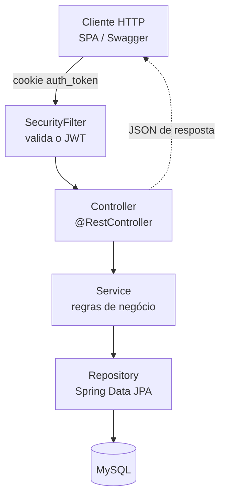
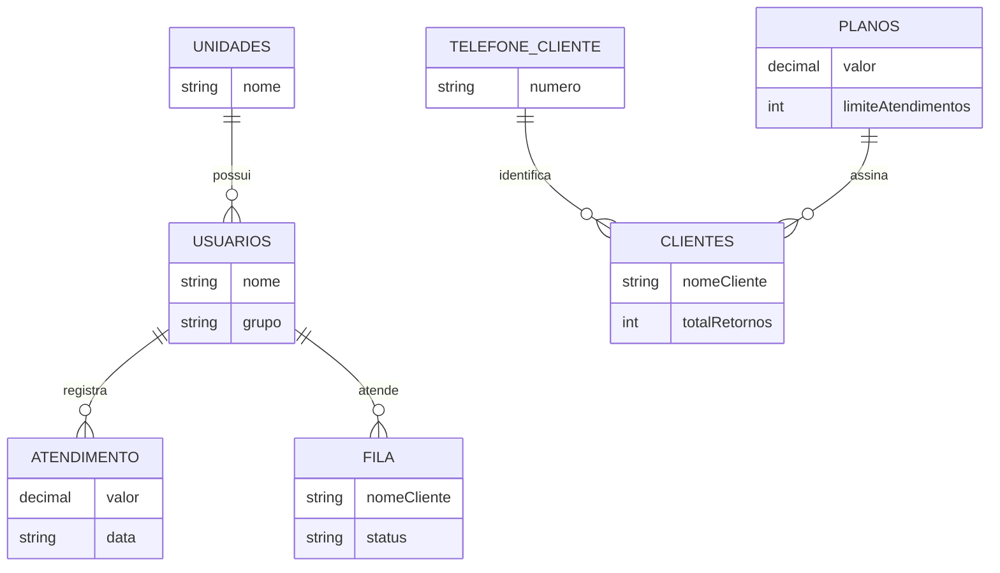

# Zenix App — Backend

<p>
  
  
  
  
  
  
</p>

> Para contexto do produto como um todo (domínio, funcionalidades, roadmap), veja o [README raiz](../README.md).

## Sobre este módulo

Este é o backend do Zenix App: uma API REST em Java/Spring Boot responsável pelas regras de negócio, persistência e autenticação do sistema de gestão de barbearias. É consumida pela SPA em [`frontend/`](../frontend).

## Arquitetura

A API segue uma arquitetura em camadas simples e pragmática: `Controller → Service → Repository → Entity`, com DTOs de request/response mapeados a partir das entidades via MapStruct/ModelMapper.



<details>
<summary>Ver o fluxo em texto</summary>

```text
Cliente HTTP (SPA / Swagger)
        |  requisição + cookie auth_token
        v
SecurityFilter        -> valida o JWT
        v
Controller            -> @RestController
        v
Service               -> regras de negócio
        v
Repository            -> Spring Data JPA
        v
MySQL

A resposta volta pelo caminho inverso, convertida em DTO
pelo Service e serializada em JSON pelo Controller.
```

</details>

## Modelo de domínio



<details>
<summary>Ver os relacionamentos em texto</summary>

```text
UNIDADES          1 --- N  USUARIOS      (uma unidade possui vários usuários)
USUARIOS          1 --- N  ATENDIMENTO   (um barbeiro registra vários atendimentos)
USUARIOS          1 --- N  FILA          (um barbeiro atende várias entradas da fila)
TELEFONE_CLIENTE  1 --- N  CLIENTES      (o telefone identifica o cliente)
PLANOS            1 --- N  CLIENTES      (um plano é assinado por vários clientes)

SERVICOS e FORMA_PAGAMENTO são catálogos independentes,
sem chave estrangeira formal.
```

</details>

Campos completos de cada entidade estão nas classes em `models/entities/` e nos schemas do Swagger UI.

| Entidade | Representa |
|---|---|
| `Unidades` | Uma barbearia/filial; agrupa usuários, fila e atendimentos. |
| `Usuarios` | Barbeiro ou administrador, com papel (`grupo`) `ADMIN`/`USER`. |
| `Clientes` | Cliente da barbearia, com contador de retornos e uso do plano no mês. |
| `TelefoneCliente` | Telefone único usado para localizar clientes entre atendimentos. |
| `Atendimento` | Serviço registrado por um barbeiro (valor, forma de pagamento, data). |
| `Fila` | Entrada de um cliente na fila de espera de uma unidade. |
| `Planos` | Plano de assinatura mensal com limite de atendimentos. |
| `Servicos` | Catálogo de serviços oferecidos (nome, valor). |
| `FormaPagamento` | Catálogo de formas de pagamento aceitas. |

`Servicos` e `FormaPagamento` são catálogos consultados pelas demais entidades, sem chave estrangeira formal — a maioria das entidades usa exclusão lógica (`status = 1` ativo / `-1` excluído) em vez de remoção física.

## Endpoint Health Check
- Execute `http://localhost:9090/api/v2/health` para checar a saúde da aplicação

## Stack tecnológica

| Tecnologia | Versão | Uso |
|---|---|---|
| Java | 21 | Linguagem principal |
| Spring Boot | 4.0.3 | Framework da API (`web`, `data-jpa`, `security`, `validation`) |
| Spring Data JPA | — | Persistência e acesso ao banco de dados |
| Spring Security | — | Autenticação e autorização |
| java-jwt (Auth0) | 4.5.0 | Geração e validação de tokens JWT |
| MySQL Connector/J | — | Driver de acesso ao MySQL |
| MapStruct | 1.6.3 | Mapeamento entre entidades e DTOs |
| ModelMapper | 3.1.0 | Mapeamento auxiliar entre entidades e DTOs |
| springdoc-openapi | 2.4.0 | Documentação interativa da API (Swagger UI) |
| Lombok | — | Redução de boilerplate (getters/setters/construtores) |
| H2 | — | Banco em memória usado nos testes |
| Maven | — | Build e gerenciamento de dependências |

## Estrutura de pastas

```
backend/src/main/java/cloud/zenixapp/zenix/
├── configs/
│   ├── exceptions/   # Exceções de domínio customizadas
│   ├── handlers/     # GlobalExceptionHandler, BindingHandler
│   ├── mappers/      # Mappers MapStruct entre Entity e DTO
│   └── security/     # SecurityConfig, SecurityFilter
├── controllers/      # 8 REST controllers, um por recurso
├── models/
│   ├── entities/         # Entidades JPA
│   ├── dtos/requests/     # DTOs de entrada
│   ├── dtos/responses/    # DTOs de saída
│   └── enums/             # StatusFilaEnum, UsuariosRoleEnum
├── repositories/      # Interfaces Spring Data JPA
└── services/
    └── security/       # TokenService, AuthorizationService
```

## Autenticação e autorização

- Login (`POST /api/v1/users/login`) gera um JWT assinado com HMAC256 (segredo `SECURITY_KEY`), válido por 2 horas, e o entrega em um **cookie httpOnly** chamado `auth_token` (não é retornado no corpo da resposta).
- A cada requisição, o `SecurityFilter` lê esse cookie, valida o token e popula o `SecurityContextHolder` com o usuário autenticado.
- Autorização é feita por papel: `ADMIN` recebe `ROLE_ADMIN` + `ROLE_USER`; `USER` (barbeiro) recebe apenas `ROLE_USER`. Rotas administrativas exigem `hasRole("ADMIN")`.
- Sessão é **stateless** (sem sessão no servidor) — o próprio JWT no cookie é a fonte da verdade a cada requisição.
- CORS liberado para os domínios do frontend: `http://localhost:5173`, `https://app.zenixapp.cloud`, `https://barber.zenixapp.cloud`.

## Endpoints da API

| Recurso      | Base path              | Descrição                                                                    | Acesso                                                |
|--------------|------------------------|------------------------------------------------------------------------------|-------------------------------------------------------|
| Health Check | `/api/v2/health`       | Checagem da saúde da aplicação                                               | Público                                               |
| Atendimentos | `/api/v2/atendimentos` | CRUD de atendimentos registrados por barbeiro (hoje, histórico, visão admin) | Autenticado                                           |
| Clientes     | `/api/v2/clientes`     | Cadastro, busca por telefone/nome, registro de retorno e vínculo com planos  | Público (check-in) + ADMIN (gestão)                   |
| Fila         | `/api/v2/fila`         | Entrada na fila, chamada, finalização e remoção                              | Público (entrar) + Autenticado (operar)               |
| Pagamentos   | `/api/v2/pagamentos`   | Catálogo de formas de pagamento                                              | Público (leitura) + Autenticado (escrita)             |
| Planos       | `/api/v2/planos`       | Catálogo de planos de assinatura mensal                                      | ADMIN                                                 |
| Serviços     | `/api/v2/servicos`     | Catálogo de serviços oferecidos                                              | Público (leitura) + Autenticado (escrita)             |
| Unidades     | `/api/v2/unidades`     | Gestão de unidades/filiais                                                   | ADMIN                                                 |
| Usuários     | `/api/v2/users`        | Login, sessão (`/me`), registro e gestão de usuários/barbeiros               | Público (login/register) + Autenticado/ADMIN (demais) |

Com a aplicação rodando, o detalhe completo de cada rota (parâmetros, schemas de request/response) está disponível no Swagger UI: `http://localhost:9090/swagger-ui/index.html`.

## Como executar localmente

### Pré-requisitos

- **Docker instalado e configurado**

### Variáveis de ambiente

- Veja o arquivo `example.env`

| Variável | Descrição |
|---|---|
| `DB_URL` | URL de conexão JDBC com o MySQL |
| `DB_USER` | Usuário do banco de dados |
| `DB_PASSWORD` | Senha do banco de dados |
| `SECURITY_KEY` | Segredo usado para assinar os tokens JWT |

### Docker

O `Dockerfile` é executado em estágios:
- **Stage Build:** Copia os arquivos de `backend`, baixa as dependências e empacota o jar (`mvn clean package`) usando uma imagem
`maven:4.0.0-rc-4-eclipse-temurin-21-alpine` como base. O comando para gerar o jar possui resiliência contra falhas
temporárias.
- **Stage Run:** Estágio de execução da aplicação. Ele roda em cima da imagem do `alpine:latest` que é uma imagem leve
do Linux. Copia apenas os arquivos necessários do estágio de construção para poder executar o comando
`java -jar zenixapp.jar --spring.config.import=file:.env[.properties]`, cuja importância é de executar a aplicação passando
o .env como parâmetro.

O `Docker Compose` está com os dois serviços necessários para rodar a API.


### Subindo a API
- Para executar em background, execute o comando abaixo:
```bash
cd backend
docker compose up -d
```

- Para executar analisando os logs:
```bash
cd backend
docker compose up
```

A API sobe por padrão em `http://localhost:8080/api/v1`.

[//]: # (## Testes automatizados)

[//]: # ()
[//]: # (```bash)

[//]: # (cd backend)

[//]: # (./mvnw test)

[//]: # (```)

[//]: # ()
[//]: # (Os testes rodam contra um banco H2 em memória &#40;sem depender de um MySQL real&#41;. Suíte existente:)

[//]: # ()
[//]: # (- `AtendimentoServiceTests`)

[//]: # (- `FilaServiceTest`)

[//]: # (- `UnidadeServiceTest`)

[//]: # (- `UsuarioServiceTests`)

[//]: # (- `ZenixApplicationTests` &#40;smoke test do contexto Spring&#41;)

[//]: # ()
[//]: # (Ainda **não há testes** para `ClienteService`, `PlanosService`, `ServicoService` e `PagamentoService`.)