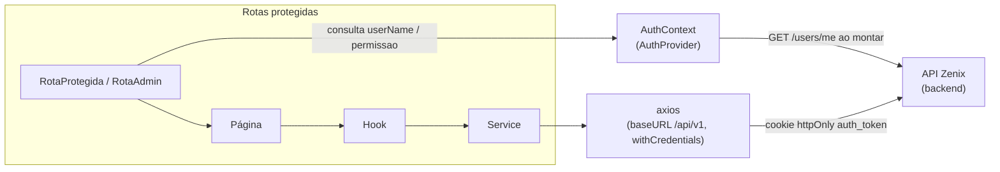

# Zenix App — Frontend

<p>
  
  
  
  
  
</p>

> Para contexto do produto como um todo (domínio, funcionalidades, roadmap), veja o [README raiz](../README.md).

## Sobre este módulo

Este é o frontend do Zenix App: uma SPA em React/TypeScript que serve de interface para donos e barbeiros (área autenticada — atendimentos, fila, clientes, planos, financeiro, dashboard) e para o fluxo público de check-in do cliente na fila de uma unidade. Consome a API em [`backend/`](../backend).

## Arquitetura



Cada página delega o acesso a dados a um hook próprio do domínio (ex: `use-atendimentos`, `use-fila`), que por sua vez chama um `service` (camada fina sobre o axios). Não há estado global além da sessão (`AuthContext`) — o estado de cada tela é local.

## Stack tecnológica

| Tecnologia | Versão | Uso |
|---|---|---|
| React | 19.2 | Biblioteca de UI |
| TypeScript | 5.9 | Tipagem estática |
| Vite | 7.3 | Build tool e dev server |
| React Router | 7.13 | Roteamento da SPA |
| Tailwind CSS | 4.2 | Estilização utilitária |
| shadcn/ui + Radix (`radix-ui`, `@base-ui/react`) | — | Biblioteca de componentes |
| Axios | 1.13 | Cliente HTTP |
| Recharts | 3.7 | Gráficos do dashboard |
| Sonner | — | Toasts/notificações |
| Lucide React | — | Ícones |
| next-themes | — | Suporte a tema (app roda fixado em modo escuro) |

## Estrutura de pastas

```
frontend/src/
├── components/
│   ├── common/    # Componentes de formulário reutilizáveis (botão, input, modal de confirmação...)
│   └── ui/        # Biblioteca de componentes shadcn/ui sobre Radix
├── contexts/      # AuthContext (sessão e permissão do usuário logado)
├── enviroments/   # Instância única do axios (baseURL da API)
├── hooks/         # Um hook por domínio de negócio, encapsulando chamadas aos services
├── lib/           # Helper cn() (clsx + tailwind-merge)
├── pages/
│   └── modals/    # Modais de criação/edição usados dentro das páginas
├── security/      # Guards de rota (RotaProtegida, RotaAdmin)
├── services/      # Camada de acesso à API (axios), um arquivo por recurso REST
├── types/         # Tipos TypeScript por domínio
└── utils/         # Helpers puros (datas, formatação, validação)
```

## Rotas e páginas

| Rota | Página | Acesso |
|---|---|---|
| `/login` | `login-page.tsx` | Público |
| `/fila/:unidadeId` | `login-fila-page.tsx` | Público (check-in do cliente) |
| `/atendimentos` | `atendimento-page.tsx` | Autenticado |
| `/financeiro` | `financeiro-page.tsx` | Autenticado |
| `/fila` | `fila-page.tsx` | Autenticado |
| `/usuarios` | `usuarios-page.tsx` | ADMIN |
| `/dashboard` | `dashboard-page.tsx` | ADMIN |
| `/unidades` | `unidade-page.tsx` | ADMIN |
| `/servicos` | `servicos-page.tsx` | ADMIN |
| `/pagamentos` | `pagamentos-page.tsx` | ADMIN |
| `/clientes` | `clientes-page.tsx` | ADMIN |
| `/planos` | `planos-page.tsx` | ADMIN |
| `/*` | `not-found-page.tsx` | Público (fallback) |

> `src/pages/register-user-page.tsx` existe no código mas não está registrada em nenhuma rota de `App.tsx` — não é acessível hoje.

## Autenticação no frontend

- Ao carregar, `AuthProvider` (`src/contexts/auth-context.tsx`) chama `GET /users/me` para tentar restaurar a sessão a partir do cookie; se falhar, considera o usuário deslogado.
- Login (`hooks/use-login.ts` → `services/auth-service.ts`) chama `POST /users/login`; em caso de sucesso, o backend grava o cookie httpOnly `auth_token` e o contexto passa a guardar `userName`/`permissao`.
- Logout chama `POST /users/logout`, que expira o cookie no backend.
- `security/rota-protegida.tsx` redireciona para `/login` se não houver sessão; `security/rota-admin.tsx` redireciona para `/atendimentos` se o usuário não for `ADMIN`.
- Não há token manipulado no cliente (sem `localStorage`) — tudo via cookie httpOnly + `withCredentials: true`.

## Comunicação com a API

- Instância única do axios em `src/enviroments/enviroments.ts`, com `baseURL: "/api/v1"` e `withCredentials: true`.
- Em produção, a base relativa funciona porque o Nginx (`frontend/nginx.conf`) faz proxy reverso de `/api/` para o serviço `barber_app:9090`.
- **Em desenvolvimento não há proxy configurado no Vite** (`vite.config.ts` não tem `server.proxy`) — para o `npm run dev` conseguir chamar o backend local, é preciso descomentar em `enviroments.ts` a linha alternativa que aponta direto para `http://localhost:9090/api/v1`.

## Como executar localmente

### Pré-requisitos

- Node.js 20+ e npm
- Backend rodando (veja [`backend/README.md`](../backend/README.md))

### Comandos

```bash
cd frontend
npm install
npm run dev
```

A aplicação sobe por padrão em `http://localhost:5173`. Para as chamadas à API funcionarem localmente, veja a nota sobre o proxy de desenvolvimento em "Comunicação com a API" abaixo.

Outros scripts disponíveis: `npm run build` (build de produção), `npm run lint` (ESLint), `npm run preview` (preview do build).

Não há `.env`/variáveis de ambiente no frontend hoje — a URL da API é configurada diretamente em `src/enviroments/enviroments.ts`.

## Testes automatizados

Não há testes automatizados configurados no frontend no momento: nenhuma dependência de teste (Vitest, Jest, Testing Library) no `package.json`, nem arquivos `*.test.*`/`*.spec.*` no projeto.
